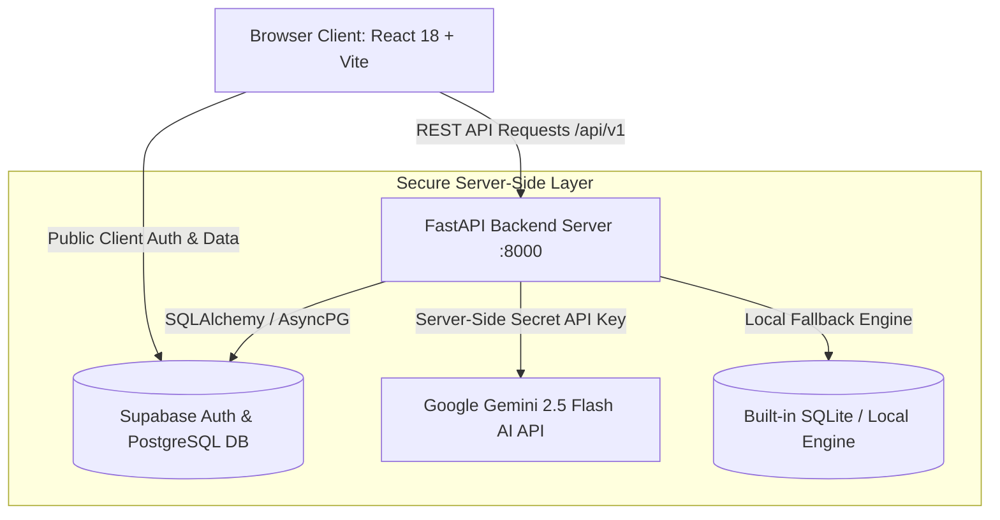

# 🎓 Student Lifeline — AI Academic Operating System

> **Turn Study Chaos Into Academic Mastery With AI.**  
> A personalized, syllabus-grounded academic operating system for ambitious university students. Featuring automated daily study missions, textbook-grounded Gemini AI tutor with RAG source citations, SM-2 active recall flashcards, 7-day exam readiness forecasting, and automated attendance tracking.

---

## 🏛️ System Architecture

Student Lifeline is engineered using a decoupled, multi-tier architecture designed for security, scalability, and instant jury evaluation:



### Key Security & Design Invariants:
1. **Server-Side AI Integration**: The Google Gemini API key (`GEMINI_API_KEY`) is kept strictly inside the FastAPI backend environment. **No private API keys or secret credentials are ever bundled or exposed in client browser JavaScript.**
2. **Supabase Integration & RLS**: Data models are secured via Row Level Security (RLS) policies in PostgreSQL (`supabase/migrations/`). Public frontend clients communicate using the public anonymous key (`VITE_SUPABASE_ANON_KEY`).
3. **Zero-Config Jury Fallback Engine**: If a jury evaluator runs the application without providing external Supabase or Gemini API keys, the application automatically falls back to an embedded SQLite engine (`lifeos_dev.db`) and local AI simulation engine. **The jury can test 100% of features out of the box with zero external setup!**

---

## 🛠️ Technology Stack

| Layer | Technology | Purpose |
| :--- | :--- | :--- |
| **Frontend** | React 18, TypeScript, Vite, Tailwind CSS, Lucide Icons, Recharts, TanStack Query | Responsive UI/UX across Mobile, Tablet, and Desktop viewports |
| **Backend API** | Python 3.10+, FastAPI, Pydantic v2, APScheduler, PyMuPDF | REST API, background task scheduler, SM-2 active recall calculations |
| **AI Engine** | Google Gemini API (`google-genai` SDK: `gemini-2.5-flash`, `text-embedding-004`) | Step-by-step Feynman explanations, PDF RAG tutoring, quiz generation |
| **Database & Auth** | Supabase PostgreSQL with `pgvector` & Row Level Security (RLS) | Authentication, relational data, vector search embeddings |
| **Fallback DB** | SQLite (`lifeos_dev.db`) + Local Storage Engine | Zero-dependency offline evaluation mode for instant local testing |

---

## 📱 Multi-Device Responsiveness (Mobile, Tablet & Laptop)

The application features custom responsive breakpoints tailored to device aspect ratios:
- 📱 **Mobile Devices (`< 768px`)**: Touch-friendly hamburger menu (`Menu`), slide-out navigation drawer overlay with dark backdrop blur, single-column task boards, auto-close navigation on selection, and zero horizontal overflow.
- 📱 **Tablets & Foldables (`768px - 1024px`)**: Dual-column grid layouts, collapsible icon-only sidebar (`w-20`), and responsive header action badges.
- 💻 **Laptops & Desktops (`> 1024px`)**: Full widescreen experience, 3 & 4-column card grids (`sm:grid-cols-2 lg:grid-cols-4`), and expanded navigation categories.

---

## ⚡ Quickstart Guide for Jury Evaluators

Jury members can test the application locally in **less than 2 minutes** without setting up cloud accounts or obtaining third-party API keys.

### Prerequisites
- **Node.js**: v18.0.0 or higher
- **Python**: v3.10 or higher

### Zero-Config Local Mode (Recommended for Instant Testing)

1. **Clone the repository**:
   ```bash
   git clone https://github.com/your-username/student-lifeline.git
   cd student-lifeline
   ```

2. **Start the Backend API Server**:
   ```bash
   cd backend
   python -m venv venv

   # On Windows (PowerShell):
   .\venv\Scripts\activate
   # On macOS/Linux:
   source venv/bin/activate

   pip install -r requirements.txt
   uvicorn app.main:app --reload --port 8000
   ```
   *The backend will automatically start up on `http://localhost:8000` using the local SQLite database.*

3. **Start the Frontend Web Application**:
   Open a new terminal window:
   ```bash
   cd frontend
   npm install
   npm run dev
   ```

4. **Open in Browser & Log In**:
   Navigate to `http://localhost:5173`. You can log in using either the **⚡ 1-Click Instant Demo** button or the following credentials:

> [!TIP]
> ### 🔑 Jury Evaluation Login Credentials
> - **Email**: `john@gmail.com`
> - **Password**: `john123`
> *(Any email/password will also auto-authenticate in zero-config mode).*

---

## ☁️ Full Hosted Cloud & Supabase Setup

To connect the application to your own live Supabase PostgreSQL database and Google Gemini API:

### Step 1: Database Migration (Supabase)
1. Log in to [Supabase](https://supabase.com) and create a new project.
2. Open the **SQL Editor** in your Supabase dashboard.
3. Execute the migration scripts in order:
   - `supabase/migrations/20260916000000_lifeos_init.sql`
   - `supabase/migrations/20260918000000_subject_units_sync.sql`
4. Create a Storage Bucket named `lifeos-vault` under **Storage**.

### Step 2: Environment Variables Setup
Copy `.env.example` to `.env` in the root folder and populate your cloud keys:
```bash
cp .env.example .env
```

| Variable Name | Environment | Description / Recommended Value |
| :--- | :--- | :--- |
| `VITE_SUPABASE_URL` | Frontend (Public) | Your Supabase Project URL (`https://xyz.supabase.co`) |
| `VITE_SUPABASE_ANON_KEY` | Frontend (Public) | Your Supabase Public Anonymous Key |
| `VITE_API_BASE_URL` | Frontend (Public) | Backend API endpoint (`http://localhost:8000/api/v1`) |
| `SUPABASE_URL` | Backend (Private) | Your Supabase Project URL |
| `SUPABASE_SERVICE_ROLE_KEY` | Backend (Private) | Your Supabase Service Role Key |
| `DATABASE_URL` | Backend (Private) | AsyncPG connection string (`postgresql+asyncpg://...`) |
| `GEMINI_API_KEY` | Backend (Private) | Your Google Gemini API Key |
| `GEMINI_MODEL` | Backend (Private) | `gemini-2.5-flash` |

---

## 🌟 Core Feature Matrix

- 🎯 **Today's Mission**: Dynamically balanced daily study task manager adjusting to lecture commitments, pending exams, and peak study velocity.
- 🤖 **Ask Student Lifeline**: AI Academic Tutor supporting Feynman step-by-step explanations, code debugging, and PDF document RAG with page citations.
- 🎴 **SM-2 Active Recall Flashcards**: SuperMemo-2 (SM-2) algorithm scheduling flashcard reviews based on historical recall accuracy.
- 📝 **Timed Quizzes & Exam Radar**: Countdown timers, question palettes, auto-graded scoring, and automatic logging to your **AI Mistake Notebook**.
- 📅 **Calendar & Exam Planner**: Unified view combining weekly course lecture commitments with day-by-day exam countdown roadmaps.
- 📊 **Academic Analytics & Attendance**: Monitor progress towards target GPA, track weekly deep work hours, and ensure course attendance remains above the 75% threshold.

---

## 🧪 Testing & Verification Commands

### Execute Backend Test Suite
```bash
cd backend

# On Windows PowerShell:
$env:PYTHONPATH="."
pytest -v

# On macOS/Linux:
PYTHONPATH=. pytest -v
```
*(Runs unit & integration tests covering auth, SM-2 flashcard calculation, analytics, and scheduler functionality).*

### Execute Frontend Production Build
```bash
cd frontend
npm run build
```
*(Compiles TypeScript code and generates optimized distribution assets).*

---

## 🚀 GitHub Submission Instructions

To push this codebase to a new GitHub repository securely:

```bash
# 1. Initialize git repository (if not already initialized)
git init

# 2. Stage all files (sensitive files are automatically excluded by .gitignore)
git add .

# 3. Verify staged status to ensure no .env files are staged
git status

# 4. Commit changes
git commit -m "feat: complete jury-ready Student Lifeline AI academic platform"

# 5. Connect to your GitHub repository and push
git branch -M main
git remote add origin https://github.com/YOUR_GITHUB_USERNAME/student-lifeline.git
git push -u origin main
```

---

## 🔒 Security Compliance Statement

- **Zero Secret Commits**: Actual API keys, service role tokens, and database passwords are listed in `.gitignore` and **never committed to git history**.
- **Data Protection**: User data access is protected by Supabase PostgreSQL Row Level Security (RLS) policies requiring valid user JWT tokens.
- **Client Security**: Frontend JavaScript bundles only contain public, non-sensitive configuration keys.

---

## 📜 License & Credits

Designed & Built with ❤️ for ambitious university students worldwide. Powered by Google Gemini AI & Supabase.
